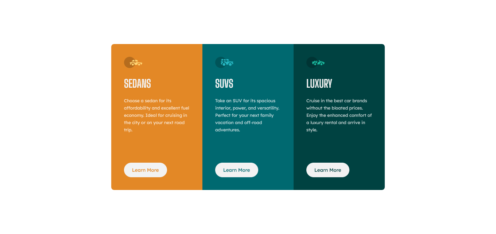

# Frontend Mentor - 3-column preview card component solution

This is a solution to the [3-column preview card component challenge on Frontend Mentor](https://www.frontendmentor.io/challenges/3column-preview-card-component-pH92eAR2-). Frontend Mentor challenges help you improve your coding skills by building realistic projects. 

## Table of contents

- [Overview](#overview)
  - [The challenge](#the-challenge)
  - [Screenshot](#screenshot)
  - [Links](#links)
- [My process](#my-process)
  - [Built with](#built-with)
  - [What I learned](#what-i-learned)
- [Author](#author)

## Overview

### The challenge

Users should be able to:

- View the optimal layout depending on their device's screen size
- See hover states for interactive elements

### Screenshot

### Links

- Solution URL: [https://github.com/michaeljohnson-mj/frontend-mentor-three-column-preview-card.git](https://github.com/michaeljohnson-mj/frontend-mentor-three-column-preview-card.git)
- Live Site URL: [https://michaeljohnson-mj.github.io/frontend-mentor-three-column-preview-card/](https://michaeljohnson-mj.github.io/frontend-mentor-three-column-preview-card/)

## My process

### Built with

- Semantic HTML5 markup
- CSS custom properties
- Flexbox
- Media Queries

### What I learned

- Flexbox
- Media Queries
- CSS Variables
- Different CSS Selectors

## Author

- Website - [https://www.michaeljohnson.tech](https://www.michaeljohnson.tech)
- Frontend Mentor - [https://www.frontendmentor.io/profile/michaeljohnson-mj](https://www.frontendmentor.io/profile/michaeljohnson-mj)
